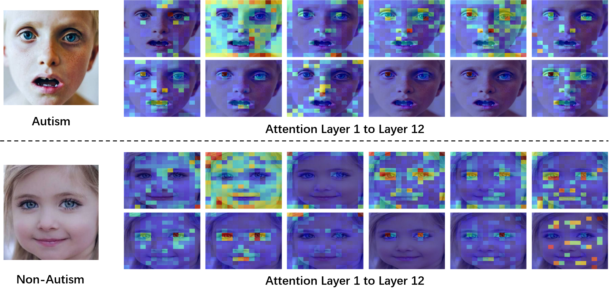

# [ICASSP 2023] ViTASD: Robust Vision Transformer Baselines for Autism Spectrum Disorder Facial Diagnosis
### Official PyTorch Implementation
Shenzhen Children's Hospital    
New York University    


### Abstract
Autism spectrum disorder (ASD) is a lifelong neurodevelopmental disorder with very high prevalence around the world. Research progress in the field of ASD facial analysis in pediatric patients has been hindered due to a lack of well-established baselines. In this paper, we propose the use of the Vision Transformer (ViT) for the computational analysis of pediatric ASD. The presented model, known as ViTASD, distills knowledge from large facial expression datasets and offers model structure transferability. Specifically, ViTASD employs a vanilla ViT to extract features from patients' face images and adopts a lightweight decoder with a Gaussian Process layer to enhance the robustness for ASD analysis. Extensive experiments conducted on standard ASD facial analysis benchmarks show that our method outperforms all of the representative approaches in ASD facial analysis, while the ViTASD-L achieves a new state-of-the-art.     




## Dataset  

Publicly available datasets were analyzed in this study. The original data page can be found at: [Kaggle](https://www.kaggle.com/cihan063/autism-image-data). The author update the dataset to a new [Google Drive](https://drive.google.com/drive/folders/1XQU0pluL0m3TIlXqntano12d68peMb8A)      


Other useful dataset for computer vision in Autism Spectrum Disorder detection:    

[DE-ENIGMA Dataset](https://de-enigma.eu/database/)  
[Saliency4ASD dataset](https://saliency4asd.ls2n.fr/datasets/)  

We will expand the research for these datasets in the future. And we are also trying to build a new benchmark for ASD facial diagnosis using many new datasets in Shenzhen's children. Any news for this benchmark will be updated to this Github repo until we publish the competition. This project will create a completely non-profit platform for ASD early intervention around the world.    

## Model   


## Pre-trained in AffectNet Dataset   

```
python train_affectnet.py fit -c ./configs/config_affectnet_base.yaml
```

```
python train_affectnet.py fit -c ./configs/config_affectnet_large.yaml
```


## Training    

```
python train.py fit -c ./configs/config_vitasd_small.yaml
```

```
python train.py fit -c ./configs/config_vitasd_base.yaml
```

```
python train.py fit -c ./configs/config_vitasd_large.yaml
```

### Monitoring the training ('X' is S, B, or L)

```
tensorboard --logdir=./lightning_logs/ViTASD-'X'
```


## Evaluation   
pending
